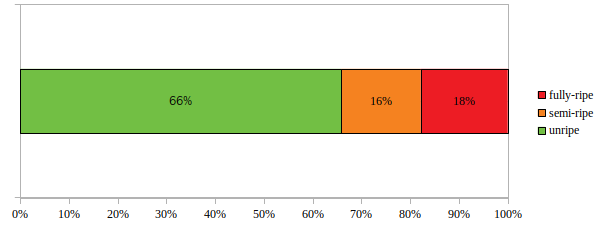
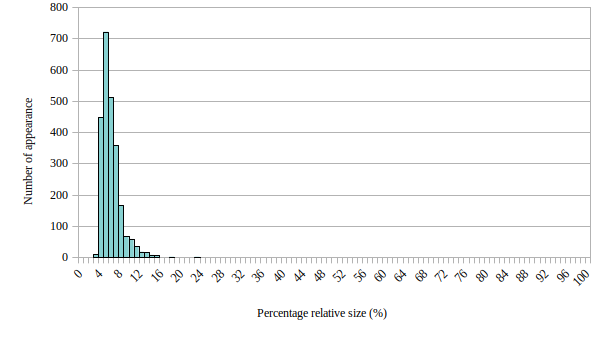
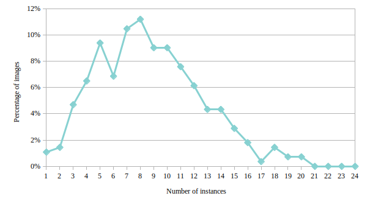
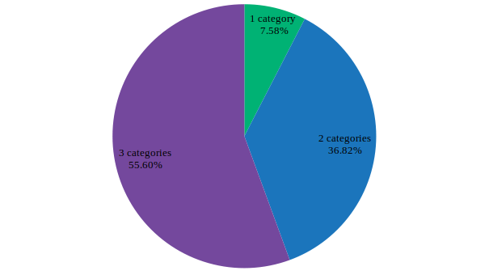
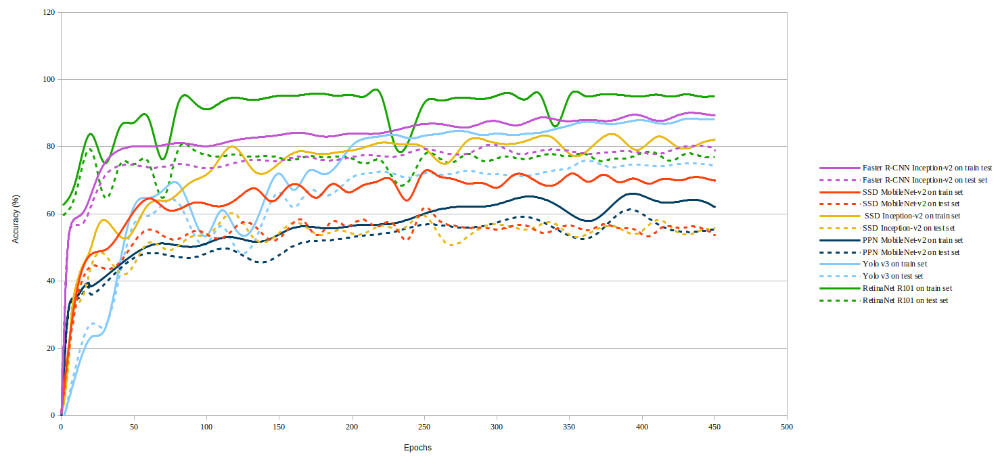
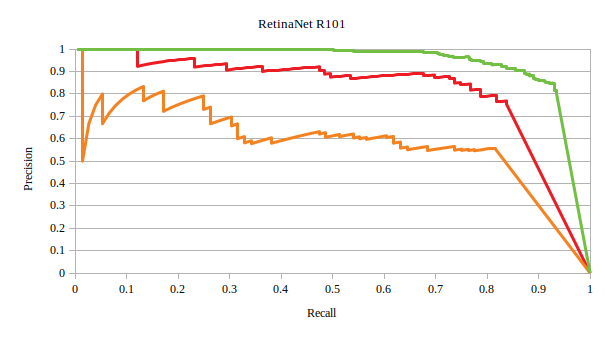

# tomatOD
**tomatOD** is a dataset for tomato fruit localization and ripening classification, containing images of tomato fruits in a greenhouse and high-quality expert annotations from agriculturists. It is a task-specific object detection dataset for tomato fruits, suitable for precision agriculture applications that typically require highly-accurate localization.

The tomatOD dataset consists of 277 images with 2418 annotated tomato fruit samples of unripe, semi-ripe and fully-ripe classes.

The images and the annotations  are licensed under [CC BY-NC-SA 4.0](https://creativecommons.org/licenses/by-nc-sa/4.0/) license. The contents of this repository are released under the [license](https://github.com/up2metric/tomatOD/blob/master/LICENSE).

Sample images with tomato fruit annotations are shown below.

 

### Download the data
* [Images](https://datasets-u2m.s3.eu-west-3.amazonaws.com/tomatOD_images.zip)
* [Bounding box annotations (train and validation sets)](https://datasets-u2m.s3.eu-west-3.amazonaws.com/tomatOD_annotations.zip)

### Data organization
The dataset was split into train and test set according to a 80%/20% train-test split ratio.
Please, note that the selection of the training and test data was conducted in a semi-random manner. The following table shows the number of images and annotated boxes of train and test sets of the tomatOD dataset.

|                 | Train | Test |
|:-----------------:|:-------:|:------:|
| Images          | 222   | 55   |
| Annotated   boxes | 1952  | 466  |

### Data Format
The annotations of the tomatOD dataset are provided in a COCO compatible format.

### Statistics and data analysis
##### tomatOD classes
The table below shows the number of annotated objects for each class of the **tomatOD** dataset.

| unripe | semi-ripe | fully-ripe |
|:------:|:---------:|:----------:|
| 1592   | 395       | 431        |

Additionally, the following figure illustrates the relative appearance frequencies of those three classes of the dataset.
The classes of the tomatOD dataset are clearly not balanced, however their relative proportion is in line with the actual appearance frequency of each class in a realistic scenario.

##### Size distribution of bounding boxes
The percentile relative size of each bounding box is calculated, which indicates the proportion of the diagonal length of each box over the diagonal length of the image.
In the image below, the histogram of the percentile relative size distribution of the tomatOD bounding boxes is presented.
Most of the bounding boxes have a size of 3% to 15% relative to the image size.

##### Number of labelled instances per image
Only 1% of images have one category per image and 11% of images include 8 instances, while the maximum number of instances per image, which is 20, is found only in 0.72% of the images.
The tomatOD dataset has an average of 8.7 instances per image. The image displays the histogram of the number of annotation instances per image.

##### Number of categories in images
As the next figure shows, more than 50% of the tomatOD images contain objects of all 3 categories, while less than 8% of the images have objects of a single category.  

### Experiment
Six state-of-the-art detectors are evaluated at the proposed tomatOD dataset. In detail, Faster RCNN with Inception v2, SSD with both Inception v2 and Mobilenet v2, PPN with Inception v2, RetinaNet (ResNet 101) and Yolo v3 are trained on tomatOD train set for 450 epochs, all of them pretrained on COCO dataset. Afterwards, they are evaluated on test set. Hyperparameter fine-tuning was performed for all networks in order to perform optimally on the tomatOD dataset.

The figure below illustrates the accuracy over epochs for both the train and the test set for every trained model.

Retina outperformed the rest detectors, yielding an accuracy of 79.4 %. The average precision of each class, the mAP metrics and precision-recall curves for classes of RetinaNet are listed.

In the precision-recall curves diagram, the unripe class is indicated by the green line, the semi-ripe class by the orange line, while the fully-ripe class by red line.

| | unripe AP (%)| semi-ripe AP (%)| fully-ripe  (%)| mAP  (%)|
|:------:|:------:|:---------:|:----------:|:----------:|
| RetinaNet | 91.47   | 55.28       | 76.77       | 74.51 |

### Citations
We hope that researchers in any domain will find the tomatOD dataset helpful for their own research. If you use the tomatOD dataset in your work, please cite it as:

"Tsironis V., Bourou S., Stentoumis C. (2020). tomatOD: Evaluation of object detection algorithms on a new real-world tomato dataset. In ISPRS - International Archives of the Photogrammetry, Remote Sensing and Spatial Information Sciences. Available from https://github.com/up2metric/tomatOD ".
